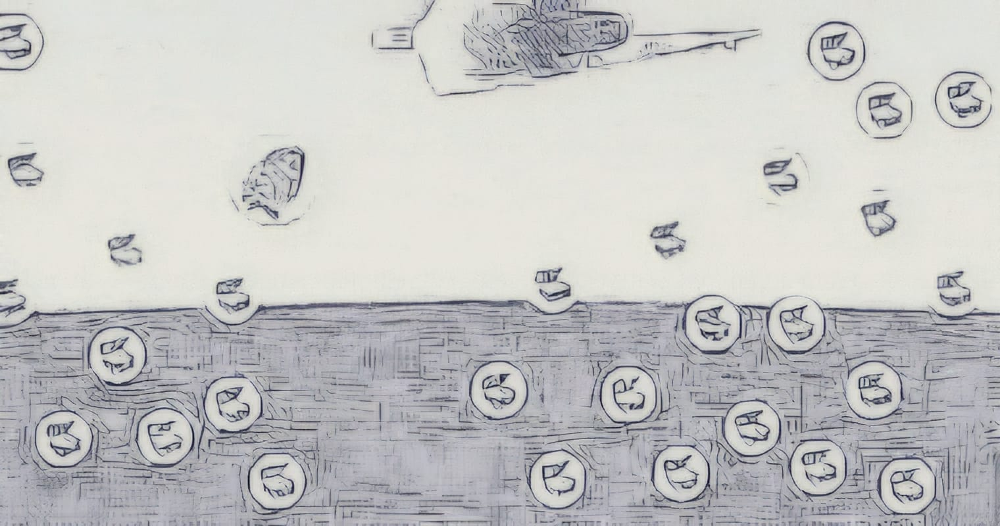
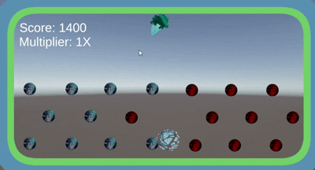

# M2GDV_Unity
## scripts
# https://github.com/DU0K/M2GDV_Unity/tree/main/Assets/assets/scripts

### Mijn inspiratie was Benthe dit zie je terug in het kannon en de ball

## les 1.2

### hier heb ik een schets gemaakt van hoe de game er uit moet komen te zien

## les 2.2

### hier heb ik het kannon gemaakt dat ballen schiet. ook heb ik hier de peggles al gemaakt

## les 3.2

### hier heb ik variatie toegevoegt in de peggles om de combosystem te laten werken deze is hier ook al toegevoegt. ik heb hier helaas geen goede gif van

## les 4.2

### Hier heb ik alle ui toegevoegt en ook mijn hele design veranderd in Avatar Sijl. Dit is ook het eindproduct van mijn Peggle Game

### Het combo systeem en de ui gingen verassend goed
### wat vond ik lastig: Na een lange uitleg nog werken en het inhalen van werk
### waar ben ik trots op: Ik zou dan toch zeggen mijn ontwerpen, maar ik denk dat ik veel beter kan dan wat ik heb gedaan.